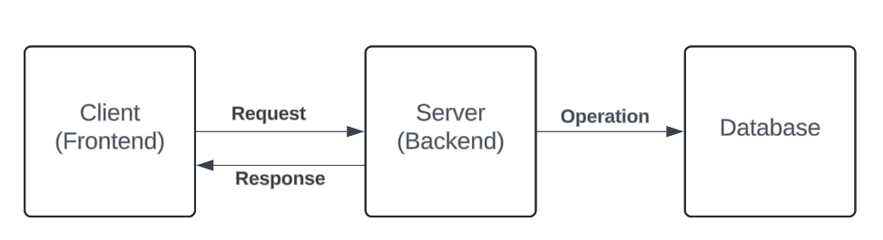

# Exercise Description

Develop an application to manage phone numbers of an organization. This application allows the user to allocate numbers of an organization.

## Table of Contents

1. [Acceptance Criteria](#acceptance-criteria)
2. [Technical Information](#technical-information)
3. [Documentation](#documentation)
   - [Application Structure](#application-structure)
   - [Backend Structure](#backend)
   - [Frontend Structure](#frontend)
4. [Tech Stack](#tech-stack)
   - [Frontend](#frontend)
   - [Backend](#backend)
   - [Database](#database)
   - [Containerization](#containerization)
5. [How to Run this Program](#how-to-run-this-program)
   - [With Docker](#with-docker)
   - [Without Docker](#without-docker)

## Acceptance Criteria

- The application can be used by different organizations. They will be differentiated by their own ID.
- Each organization can view a list with the users who have a phone number assigned. This list contains the ID/passport, the name and the surname of the user, and the corresponding number.
- A number can be allocated to a user. To do this, it is necessary to send the ID/passport, the name, and the surname.
- The number to allocate must be in a list of available numbers. This list is a master data which will be populated as setup of the project.
- The user can only have one number.

## Technical Information

- All the data will be stored in a MongoDB database.
- The application must be developed in NodeJS in Back End and React in Front End, both must be done with TypeScript.
- Implement the tests that you consider.
- Document the API with OpenAPI.
- Usage of containers is a nice to have.

# Documentation

## Application Structure


<br>

1. **Client (Frontend)**:
    - The client represents the user interface of the application, which users interact with directly via a web browser or mobile application.
    - The client sends **requests** to the server and receives **responses**. These interactions are often in the form of HTTP requests and responses, with data typically exchanged in formats like HTML or JSON.
    - Using **React** and web development technologies.

2. **Server (Backend)**:
    - The server handles the business logic of the application. It processes requests from the client, performs operations, and interacts with the database.
    - The server receives **requests** from the client, processes them, interacts with the database for any necessary data operations, and sends **responses** back to the client.
    - Using **Node.js**.

3. **Database**:
    - The database stores all persistent data for the application, such as user information, transactions, and content.
    - The server performs **operations** on the database, including querying data, updating records, and deleting entries.
    - Using **MongoDB**.

4. **Workflow**:
    - The typical workflow begins with the client sending a **request** to the server. For example, a user may request to view their profile page.
    - The server processes this request, performs any necessary authentication and data retrieval from the database, and then sends a **response** back to the client.
    - The client then processes and renders this response for the user.

This architecture ensures a clear separation of concerns between the user interface, business logic, and data storage, facilitating efficient development and maintenance of the application.

<br>

## Backend


<br>

1. **Routes**:
    - Routes define the endpoints that the client can access. They map HTTP requests to the appropriate controller actions.
    - Each route specifies a URL path and the corresponding HTTP method (GET, POST, PUT, DELETE).

2. **Controller**:
    - The controller handles incoming HTTP requests and sends responses back to the client.
    - It processes the requests by invoking the appropriate service methods.
    - Controllers ensure that the application logic is separate from the routing logic and presentation layer.

3. **Service**:
    - The service layer contains the business logic of the application.
    - It performs operations and manipulates data according to the business rules.
    - Services are called by the controllers and can call repositories to interact with the database.

4. **Repository**:
    - The repository layer abstracts the database operations.
    - It provides methods to perform CRUD (Create, Read, Update, Delete) operations on the database.
    - Repositories ensure that the database access logic is separate from the business logic.

5. **Database**:
    - The database stores all the persistent data of the application.
    - It can be a SQL or NoSQL database, depending on the application requirements.
    - The repository interacts with the database to perform data operations.

### Workflow
1. A request is received by the **Routes**, which maps it to the corresponding **Controller** action.
2. The **Controller** processes the request and calls the necessary **Service** method.
3. The **Service** executes the business logic and may interact with the **Repository** to fetch or manipulate data.
4. The **Repository** communicates with the **Database** to perform the required operations.
5. The result is passed back through the **Service** and **Controller** to the client as a response.

This architecture ensures that the responsibilities are clearly separated, making the application easier to develop, test, and maintain.

<br>

## Frontend


<br>

| Component             | Description                                                                                      | Sub-components                            |
|-----------------------|--------------------------------------------------------------------------------------------------|-------------------------------------------|
| **App**               | The main application component that serves as the entry point for the application.               | Header, Footer, Routes                    |
| **Header**            | The header component that appears at the top of the application.                                 | -                                         |
| **Footer**            | The footer component that appears at the bottom of the application.                              | -                                         |
| **OrganizationManager** | Manages the overall organization-related functionalities.                                        | CreateOrganization, OrganizationList      |
| **CreateOrganization** | Handles the creation of new organizations.                                                       | -                                         |
| **OrganizationList**  | Lists all the organizations.                                                                     | UpdateOrganization                        |
| **UpdateOrganization**| Handles updating existing organization details.                                                  | -                                         |
| **UsersManager**      | Manages the overall user-related functionalities.                                                | CreateUser, UserList, PhoneNumberInput    |
| **CreateUser**        | Handles the creation of new users.                                                               | -                                         |
| **UserList**          | Lists all the users.                                                                             | UpdateUser                                |
| **UpdateUser**        | Handles updating existing user details.                                                          | -                                         |
| **PhoneNumberInput**  | Manages phone number input functionalities.                                                      | -                                         |

#### Component Workflow

- **App**: The central hub of the application, which includes the **Header** and **Footer** for consistent navigation and structure.
- **OrganizationManager**: Manages all organization-related tasks, including the creation of new organizations and listing/updating existing ones through **CreateOrganization** and **OrganizationList** respectively.
- **UsersManager**: Handles all user-related tasks, including the creation of new users and listing/updating existing ones through **CreateUser** and **UserList** respectively.
- **PhoneNumberInput**: Manages phone numbers, displaying them through the **Phone List**.

This structure ensures that the application's frontend is well-organized, with clear separation of concerns and a modular approach to component design.

<br>

## Tech Stack

### Frontend


### Backend


### Database


### Containerization


# How to Run this Program

## With Docker

```sh
docker-compose build
docker-compose up
```

## Without Docker

To run the program from the source code, the following steps must be followed from the root directory:

```sh
npm install
cd ./backend
npm install
npm run dev # Backend running
```

**Backend disclaimer:** If you are using a Node version higher than 20.X.X, instead of `npm run dev` you have to use `node --no-warnings=ExperimentalWarning --loader ts-node/esm ./src/index.ts`

```sh
cd ./frontend
npm install
npm run dev # Frontend running
```

**Default ports**: 
- Frontend: 5173
- Backend: 3000

---
